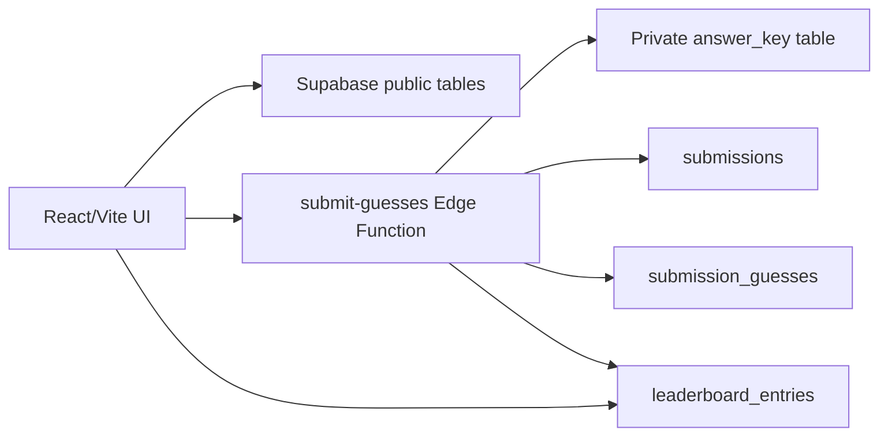

# Supabase Blueprint: Team Guessing Game

## Architecture

The app uses a Supabase-backed serverless pattern:



Netlify Basic Auth can still protect the deployed game before JavaScript loads.

## Public Browser Data

The browser uses only:

- `VITE_SUPABASE_URL`
- `VITE_SUPABASE_PUBLISHABLE_KEY`

Readable public tables:

- `participants`, ordered by `sort_order`
- `fact_options`, ordered by `display_order`
- `song_options`, ordered by `display_order`
- `leaderboard_entries`, ordered by `score desc, created_at asc`

## Private Scoring Data

The `answer_key`, `submissions`, and `submission_guesses` tables have RLS enabled and no public grants. The browser never receives the answer key.

The Edge Function reads the private answer key with Supabase server credentials that are available only inside the function environment:

- new projects: `SUPABASE_SECRET_KEYS`
- local/legacy fallback: `SUPABASE_SECRET_KEY` or `SUPABASE_SERVICE_ROLE_KEY`

## Submit Payload

```ts
{
  playerName: string;
  playerEmail: string;
  guesses: Array<{
    participantId: string;
    factId: string;
    songId: string;
  }>;
}
```

## Submit Response

```ts
{
  submissionId: string;
  score: number;
  maxScore: 18;
}
```

## Edge Function Rules

`submit-guesses`:

- accepts `POST` and CORS `OPTIONS`
- validates player name, email, exactly 9 guesses, and unique participants/facts/songs
- reads `answer_key`
- scores 1 point per correct fact and 1 point per correct song
- inserts into `submissions`
- inserts per-participant rows into `submission_guesses`
- inserts the public score into `leaderboard_entries`
- returns the score to the app

`verify_jwt = false` is intentional for v1 because players do not log in. Keep the public deployment behind Basic Auth.

## Source Files

- Frontend Supabase config: `src/config.ts`
- Browser Supabase client: `src/lib/supabaseClient.ts`
- Data loaders: `src/lib/supabaseData.ts`
- Submission client: `src/lib/formSubmission.ts`
- Mock fallback data: `src/data/sampleGameData.ts`
- Database migration: `supabase/migrations/20260709191245_team_guessing_game_schema.sql`
- Edge Function: `supabase/functions/submit-guesses/index.ts`
- Function config: `supabase/config.toml`

## Deploy Steps

```bash
npm install
cp .env.example .env.local
supabase login
supabase link --project-ref YOUR_PROJECT_REF
supabase db push
supabase functions deploy submit-guesses --no-verify-jwt
npm run build
```
